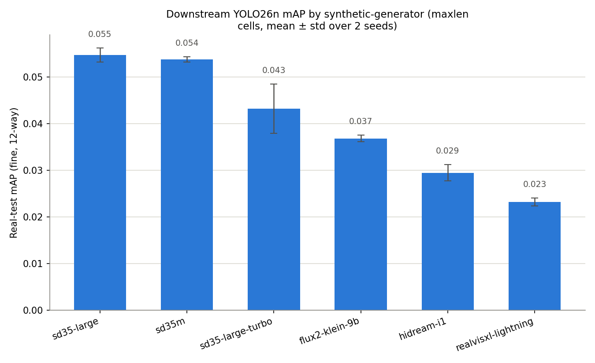
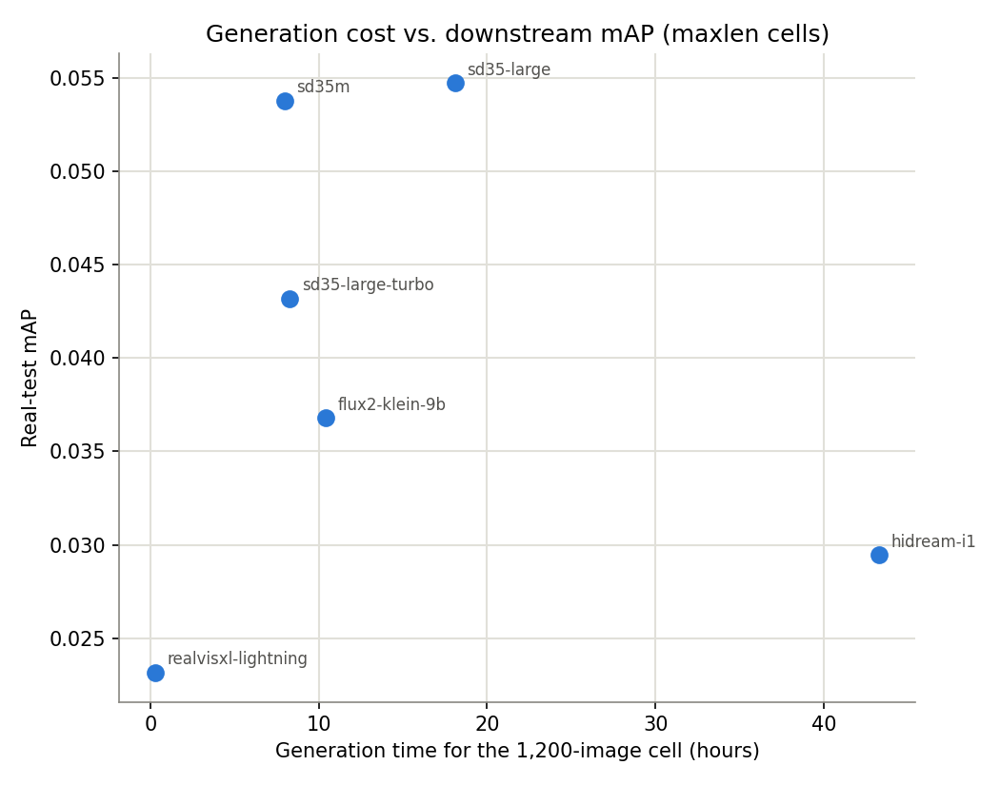
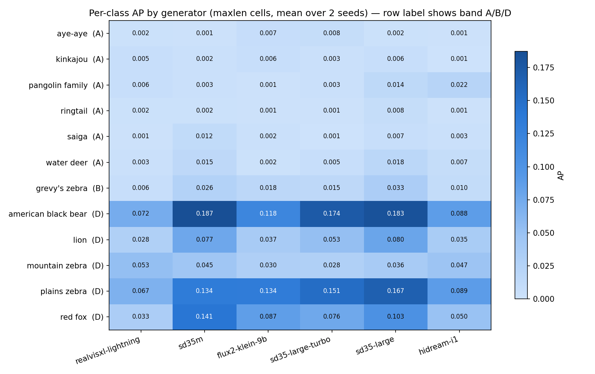
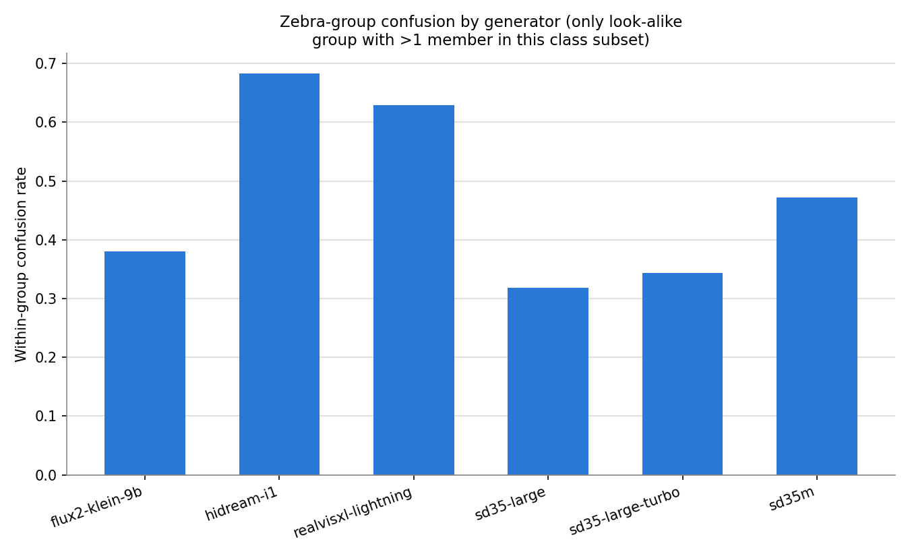

# Deep comparison of the six `maxlen` synthetic-generator cells

**Created:** 2026-08-05
**Owner:** Simon Hedrich

## Scope and status

This doc aggregates and interprets YOLO26n downstream real-test results
across all six local-diffusion `maxlen` cells: `realvisxl-lightning`,
`sd35m`, `flux2-klein-9b`, `sd35-large-turbo`, `sd35-large`, and
`hidream-i1` (just trained — see below). This is the apples-to-apples grid
the experiment's final design converged on ([`13`](13_local-model-roster-overhaul-and-maxlen-regime.md));
the API-model `full`/`compressed` cells and the incumbent
(`gemini-3.1-flash-image-preview`) use a different pipeline/prompt regime
and are out of scope here.

**Provisional, not thesis-final.** Every number below is built on
`5-export_coco.py`'s best-effort MegaDetector export — stages 3/4 (human
triage review, bbox labeling, TODO.md §3.2/§3.4) have not run on any cell.
Per current instruction, §3.4 (blind rater rubric) and §3.5 (final
writeup/decision) are deliberately **skipped for now**, so this is the
fullest comparison obtainable at present, not a final ranking. Re-running
after §3.4 lands may reorder these results.

**Real-only axis only.** Per `docs/plans/2026-06-10_model-evaluation-strategy.md`,
the default headline should be the mixed (real+synthetic) domain with a
real-only breakout alongside it — but this experiment never defined a
`mixed` test set (there's no balanced synthetic probe layered onto its
9,742-image real test set), so, consistent with the existing README table,
everything here is the **real-only** axis, which also happens to be this
strategy doc's anchor for public/external comparison.

## hidream-i1 training

Trained the same way as the other five cells — 2 seeds, `--full-eval`
against the fixed real test set:

```
uv run -m scripts.synthetic_model_comparison.training.run_training_pipeline \
    --generator hidream-i1 --prompt-regime maxlen --seed {42,43} --full-eval
```

Both runs completed cleanly (no gradient divergence, no eval-hook hang — the
two bugs fixed 2026-08-04 didn't resurface): seed 42 map=0.0282/map50=0.0579,
seed 43 map=0.0307/map50=0.0608.

## Headline ranking

Mean ± std over 2 seeds, real-test mAP (fine, 12-way):

| Rank | Generator | mAP | mAP50 | Generation time (1,200 img) |
|---|---|---|---|---|
| 1 | `sd35-large` | 0.055 ± 0.002 | 0.097 ± 0.004 | 18.11 h |
| 2 | `sd35m` | 0.054 ± 0.001 | 0.100 ± 0.001 | 7.98 h |
| 3 | `sd35-large-turbo` | 0.043 ± 0.005 | 0.090 ± 0.004 | 8.27 h |
| 4 | `flux2-klein-9b` | 0.037 ± 0.001 | 0.077 ± 0.003 | 10.40 h |
| 5 | `hidream-i1` | 0.029 ± 0.002 | 0.059 ± 0.002 | ~43.3 h (planning estimate) |
| 6 | `realvisxl-lightning` | 0.023 ± 0.001 | 0.050 ± 0.002 | 0.31 h |



Full metric vector (map_75, mar_1/10/100, medium/large splits) is in
`reports/model_comparison_maxlen_downstream_map.csv`.

**Reading the ranking:** the three Stable-Diffusion-3.5-family checkpoints
(`sd35-large`, `sd35m`, `sd35-large-turbo`) occupy the top three places, with
`sd35m` — the smallest and cheapest of the three — statistically
indistinguishable from `sd35-large` (0.054 vs. 0.055, well within a std of
each other). `sd35-large-turbo`, the distilled few-step variant of the same
base model, trails both by a real margin, suggesting the SD3.5 *training
recipe/architecture* — not raw model size or step count — is what's driving
the top-of-grid performance. `flux2-klein-9b` sits mid-pack. `hidream-i1` and
`realvisxl-lightning` anchor the bottom, for very different reasons — see the
cost-vs-quality section below.

## Cost vs. quality



There is **no monotonic relationship between generation cost and downstream
mAP.** `hidream-i1` is by far the most expensive model to run (~43.3h for a
1,200-image cell — ~5x `sd35-large`, ~140x `realvisxl-lightning`) yet lands
second-to-last, essentially tied with the cheapest model in the grid. The
extra GPU-hours bought by `hidream-i1`'s heavier architecture (it was already
flagged in doc `13` §10 as needing NF4-quantization on two of its largest
components just to fit this card, and remains the slowest model at
129.85s/image even after that) did not translate into a better detector.
`realvisxl-lightning`, at the opposite extreme — a distilled few-step SDXL
model, cheapest by a wide margin — is the *weakest* performer, so "cheap"
and "expensive" both produced the bottom two results here; the top of the
grid is the mid-cost SD3.5 family. If generation budget matters (it does —
this whole experiment exists because the production budget is largely
spent), **`sd35m` is the standout choice**: essentially tied for best
downstream mAP at roughly a fifth of `sd35-large`'s generation time and a
fraction of `hidream-i1`'s.

## Per-class breakdown



Full table (band, real-test-image count, test-limited flag, per-generator
mean±std AP) in `reports/model_comparison_maxlen_per_class_ap.csv`.

**Band D (≥400 real test images) carries essentially all of the signal.**
`american black bear` alone spans a 2.6x range across generators (0.072 →
0.187), and the same ranking (sd35m/sd35-large/sd35-large-turbo high,
realvisxl-lightning/hidream-i1 low) shows up consistently across
`plains zebra`, `red fox`, and `lion` — this is where the headline ranking
above is actually coming from.

**Band A (rare classes, <200 real test images, several `test_limited`) sits
in a noise floor for every generator** — `aye-aye`, `kinkajou`, `ringtail`,
`saiga`, `pangolin family`, `water deer` all stay in the 0.001–0.02 AP range
regardless of which model generated the training images. This is exactly
what doc [`06`](06_evaluation-methodology.md) anticipated by flagging
`test_limited` classes as needing axes A/B (the qualitative rubric,
teacher-recognition proxy) rather than downstream mAP — with this few real
positives, the mAP axis has no resolution left to distinguish generators on
these classes.

**A specific check: does `flux2-klein-9b`'s known kinkajou-tail bug show up
as measurable AP loss?** Doc [`13`](13_local-model-roster-overhaul-and-maxlen-regime.md)
§6 documented `flux2-klein-9b` consistently rendering kinkajous with a
genet/civet-like ringed tail rather than the real species' plain tail, while
`sd35-large`'s renders were confirmed correct. If that qualitative flaw
mattered downstream, `flux2-klein-9b` should show a lower kinkajou AP.
**It doesn't**: `flux2-klein-9b` = 0.0064, `sd35-large` = 0.0058 — the two
are statistically indistinguishable, both deep in the Band-A noise floor
described above (160 real test images, sub-1% AP everywhere). This is a
genuine negative result, not a confound to explain away: the downstream-mAP
axis isn't sensitive enough here to confirm *or* refute doc 13's qualitative
observation either way. Validating that specific finding is squarely axis
A's job (§3.4, the qualitative rubric) — deferred for now, so the
overall ranking above stands unaffected by this particular known artifact,
but this doc can't independently corroborate it.

## Look-alike-group confusion



The **zebra group is the dominant error mode across every generator**
(32%–68% within-group confusion — the detector reliably finds "a zebra" but
not reliably *which* of the three species). This tracks the overall mAP
ranking almost exactly: `sd35-large` has both the highest mAP and the
lowest zebra confusion (19%); `hidream-i1` and `realvisxl-lightning` have
both the lowest mAP and the highest zebra confusion (68% / 63%). That's not
two independent findings — it reads as the same underlying detector-quality
axis, not a distinct zebra-specific failure mode.

`ursus` is excluded from this metric: `american black bear` is the only
member of that look-alike group present in this 12-class subset, so its
within-group confusion rate is structurally 0 for every cell regardless of
generator quality (there is no other class it could be confused with) — not
a real signal, so it isn't reported. The genuinely varying black-bear AP
itself (0.072–0.187) is the real per-generator signal, discussed above.

## Takeaways

1. **The SD3.5 family wins this grid**, and `sd35m` is the best
   cost/quality tradeoff in it — indistinguishable from `sd35-large` at a
   fraction of the generation cost.
2. **Generation cost does not predict downstream detector quality.** The
   most expensive model (`hidream-i1`) and the cheapest (`realvisxl-lightning`)
   are the two weakest performers; cost alone explains neither end.
3. **Downstream mAP only has resolution on Band D classes** in this
   12-class subset — Band A comparisons (including the one documented
   qualitative defect checked above) need axis A (the qualitative rubric)
   to resolve, which is currently deferred.
4. **Zebra confusion isn't a separate problem** — it moves with overall
   detector quality, not independently of it.
5. This ranking is **provisional**: it rests on un-reviewed MegaDetector
   labels. Re-running after §3.4's human review lands is the natural next
   step whenever that work resumes.

## Reproducing this analysis

```
uv run python scripts/synthetic_model_comparison/6-compare_maxlen_cells.py
```

Globs every cell's `evaluation/evaluation_report.json` (falling back to
`eval_best/` for the one run — `realvisxl-lightning` seed 42 — that hit the
pre-fix eval-hang bug and was re-evaluated standalone into a differently
named directory), aggregates mean/std across seeds, and (re)writes the two
CSVs and four PNGs referenced above.
