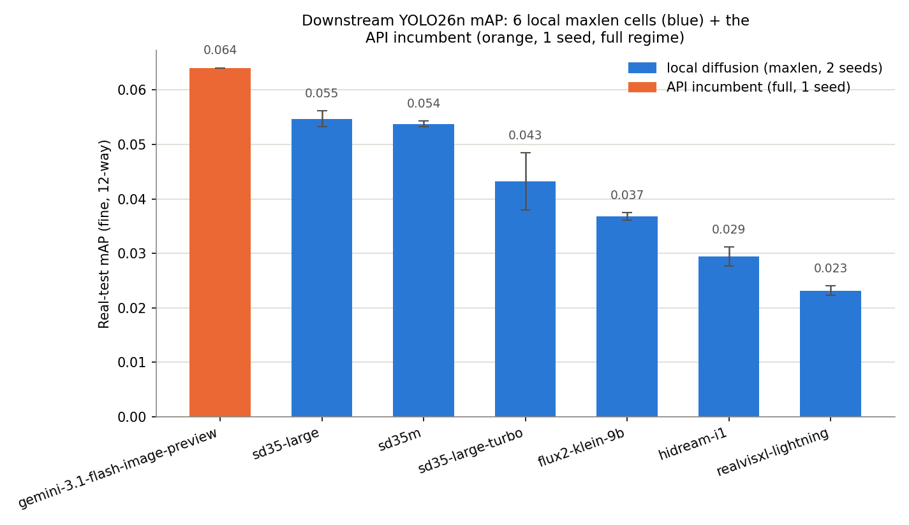
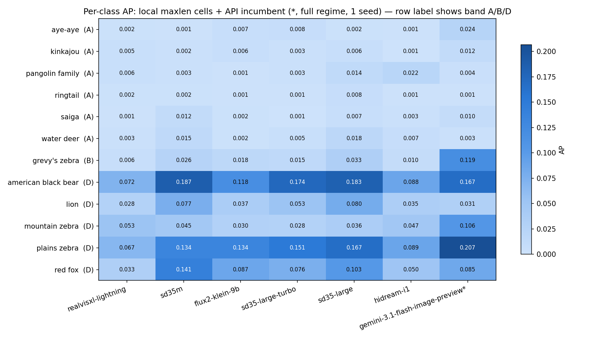
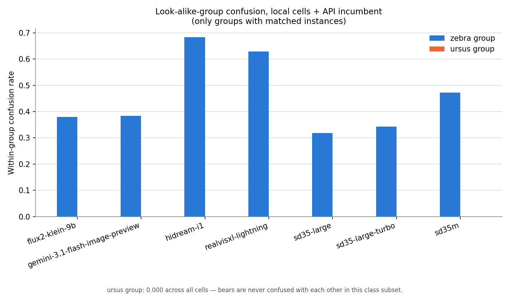

# Comparison including the API incumbent (gemini)

**Created:** 2026-08-05
**Owner:** Simon Hedrich

## Scope and status

This doc extends [`14`](14_maxlen-cell-deep-comparison.md)'s six-cell
local-diffusion `maxlen` comparison with the one API-model cell that has
actually been trained so far: `gemini-3.1-flash-image-preview` (the
production incumbent, `full` prompt regime, 1 seed). `gemini-3.1-flash-lite-image`
and both `gpt-image-2` tiers have generated images but haven't been through
the labeling pipeline or training yet — out of scope for this comparison
(per current instruction: include only the already-trained API cell, not a
larger new labeling/training campaign).

**Same provisional caveat as doc 14**: built on best-effort MegaDetector
export, not human-reviewed labels (§3.4 deferred).

## The big methodological confound: this isn't apples-to-apples

Unlike the six local cells (all `maxlen` — prompts capped at each model's
real text-encoder capacity, 256/512 tokens), the gemini incumbent cell uses
the **`full` prompt regime — the original, unabridged production-style
prompts, ~1,300 words**, effectively unconstrained (Gemini's 32k-token
context has no comparable ceiling). So this comparison conflates two
variables at once: *which model generated the images* **and** *how much
prompt detail it was given*. A result here can't be attributed to "gemini is
a better generator" in isolation — it may equally be "a ~1,300-word prompt
describes fine-grained features (e.g. exact stripe patterns) that a
256/512-token prompt physically cannot." Doc 14's six-cell comparison stays
the controlled one; treat this doc as a directional look at where the
current production choice stands, not a fair generator bake-off.

Two further asymmetries: gemini has only **1 seed** (no variance estimate,
shown as zero error bar in the chart below) vs. 2 for every local cell; and
its per-image cost is billed in € (~€0.04/image, ≈€48 for the 1,200-image
cell) rather than GPU-hours, so it isn't placed on doc 14's cost-vs-quality
scatter — the units aren't comparable.

## Headline ranking

| Rank | Generator | Regime | Seeds | mAP | mAP50 |
|---|---|---|---|---|---|
| 1 | `gemini-3.1-flash-image-preview` | full | 1 | **0.064** | 0.130 |
| 2 | `sd35-large` | maxlen | 2 | 0.055 ± 0.002 | 0.097 ± 0.004 |
| 3 | `sd35m` | maxlen | 2 | 0.054 ± 0.001 | 0.100 ± 0.001 |
| 4 | `sd35-large-turbo` | maxlen | 2 | 0.043 ± 0.005 | 0.090 ± 0.004 |
| 5 | `flux2-klein-9b` | maxlen | 2 | 0.037 ± 0.001 | 0.077 ± 0.003 |
| 6 | `hidream-i1` | maxlen | 2 | 0.029 ± 0.002 | 0.059 ± 0.002 |
| 7 | `realvisxl-lightning` | maxlen | 2 | 0.023 ± 0.001 | 0.050 ± 0.002 |



The incumbent leads the whole grid — but see the per-class breakdown below
before reading that as a uniform advantage.

## Per-class: the lead is concentrated in the zebras



Full table in `reports/model_comparison_all_per_class_ap.csv`.

The incumbent's advantage is **not spread evenly across all 12 classes** —
it's concentrated almost entirely in the three-way zebra look-alike group:

| Class | Band | gemini incumbent AP | Best local-cell AP | Margin |
|---|---|---|---|---|
| `grevy's zebra` | B | **0.119** | 0.033 (`sd35-large`) | 3.6x |
| `mountain zebra` | D | **0.106** | 0.053 (`realvisxl-lightning`) | 2.0x |
| `plains zebra` | D | **0.207** | 0.167 (`sd35-large`) | 1.2x |

On every other Band D class, the incumbent is mid-pack or below: `lion`
(0.031 — *below* four of the six local cells), `red fox` (0.085 — mid-pack),
`american black bear` (0.167 — below `sd35m`'s 0.187 and `sd35-large`'s
0.183). So the headline "gemini wins" is really "gemini wins specifically on
zebra species discrimination" — which is exactly where the confound above
matters most: the three zebra species differ mainly in fine stripe-pattern
details, precisely the kind of detail a ~1,300-word prompt can specify and a
256/512-token prompt cannot.

## Confusion: a more nuanced picture than "gemini resolves zebras better"



If gemini's zebra-AP lead came from better *fine-species discrimination*,
its zebra within-group confusion rate should be the lowest in the grid. It
isn't: gemini's zebra confusion rate is **0.385** — worse than `sd35-large`
(0.318) and `sd35-large-turbo` (0.344), and about tied with
`flux2-klein-9b` (0.380). So gemini isn't uniquely good at telling the three
zebra species apart *once it has found one* — its AP lead instead points to
better zebra **detection** overall (finding and ranking zebra boxes
correctly in the first place), with the same fine-grained confusion problem
as everyone else once a detection is made. That's a meaningfully different
explanation than "the incumbent solves the zebra look-alike problem," and
one worth carrying into any thesis-text discussion of this result.

## Takeaways

1. **Not a controlled comparison** — the `full` vs `maxlen` prompt-length
   gap confounds generator identity with prompt richness. Doc 14's six-cell
   grid remains the fair, apples-to-apples comparison.
2. **The incumbent's lead is narrow and class-specific**: it wins on the
   three zebra classes (especially `grevy's zebra`, by a wide margin) and is
   mid-pack-or-below everywhere else. It is not a uniformly stronger
   generator across the 12-class subset.
3. **The mechanism looks like better zebra detection, not better species
   discrimination** — confusion rate doesn't improve with the incumbent,
   only overall AP does.
4. 1 seed, no variance estimate — treat the incumbent's numbers as a single
   data point, not a stable average like the local cells'.
5. Still provisional pending §3.4 (unreviewed labels), same as doc 14.

## Reproducing this analysis

```
uv run python scripts/synthetic_model_comparison/7-compare_all_cells.py
```

Same aggregation logic as `6-compare_maxlen_cells.py`, generalized to
`(generator, prompt_regime)` pairs so it can also pick up the incumbent's
`full`-regime run directory naming. Writes
`reports/model_comparison_all_downstream_map.csv`,
`reports/model_comparison_all_per_class_ap.csv`, and three PNGs (no
cost-vs-quality chart — see above for why).
