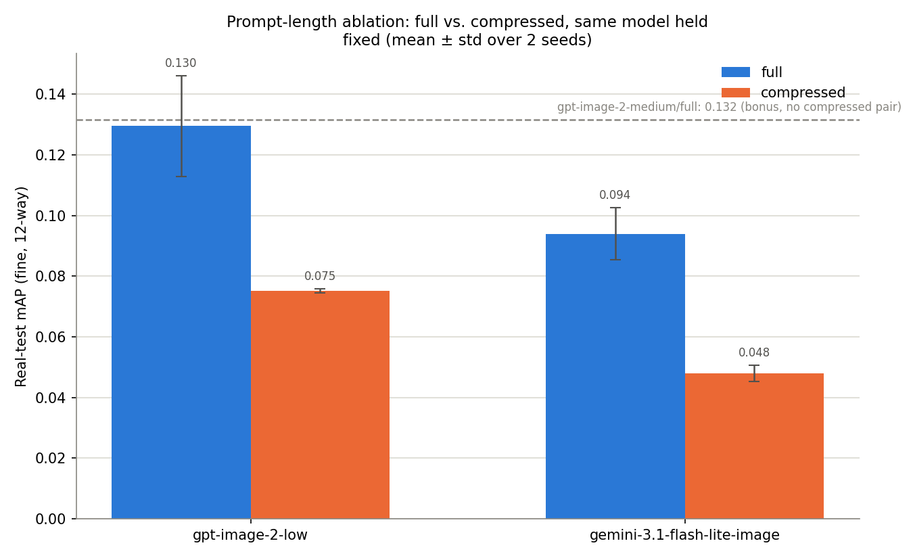
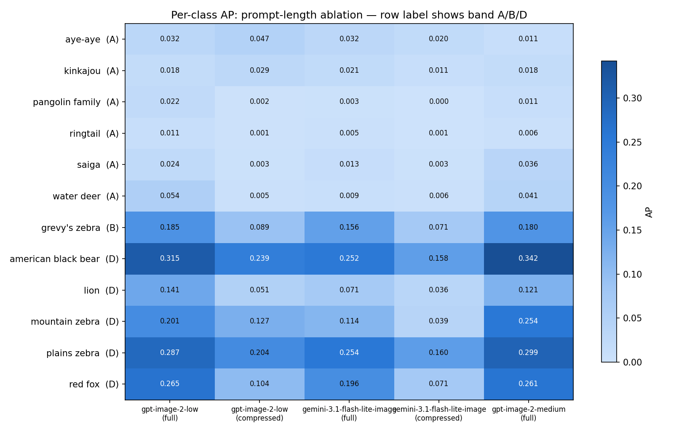

# Prompt-length ablation: full vs. compressed, same model held fixed

**Created:** 2026-08-07
**Owner:** Simon Hedrich

## Scope and status

Doc [`15`](15_all-cells-comparison-with-api-incumbent.md) compared the
gemini incumbent against the 6 local `maxlen` cells and flagged the result
as **not controlled** — the incumbent differed in two ways at once (a
different model *and* the unabridged `full` prompt vs. the local cells'
length-capped `maxlen` prompts), so its mAP lead couldn't be attributed to
either cause alone.

This doc builds the real, controlled ablation: **hold the model fixed and
vary only prompt length**, across two models —
`gpt-image-2-low` and `gemini-3.1-flash-lite-image` (the cheaper tier of
each API family) — each generated under both the `full` regime (~1,300
words) and the `compressed` regime (~55-75 tokens). A bonus fifth cell,
`gpt-image-2-medium/full`, is reported alongside for context but has no
compressed counterpart, so it sits outside the controlled 2x2 grid.

Funding: `gpt-image-2-low/compressed` (1,200 images) was projected at
**~$3.60** from the smoke test's measured token count (52,790 prompt
tokens for the full 1,197-request batch — no chunking needed, unlike
`full`'s 5-batch split); no exact post-hoc billing figure was pulled in
this session, so treat that as an estimate, not a reconciled invoice.
`gemini-3.1-flash-lite-image/compressed` was generated on a flexible
Google/Gemini budget with no cost data point (measured or estimated)
available in this session either. `gpt-image-2-low/full` (from 27.07,
$10.11), `gpt-image-2-medium/full` (from 29.07, $29.36), and
`gemini-3.1-flash-lite-image/full` (already generated) were sunk-cost
images that had never been labeled or trained before this — doing so cost
no additional money, only local GPU time.

**Same provisional caveat as docs 14/15**: built on `5-export_coco.py`'s
best-effort MegaDetector export, not human-reviewed labels (§3.4 deferred).

## Headline result: prompt length matters, and it generalizes across models



| Model | `full` mAP | `compressed` mAP | Relative drop |
|---|---|---|---|
| `gpt-image-2-low` | 0.130 ± 0.016 | 0.075 ± 0.001 | **-42%** |
| `gemini-3.1-flash-lite-image` | 0.094 ± 0.008 | 0.048 ± 0.002 | **-49%** |
| `gpt-image-2-medium` (bonus, `full` only) | 0.132 | — | — |

**This resolves doc 15's confound.** Compressing the prompt cuts downstream
mAP by roughly **40-50% for both models** — a large, consistent effect that
shows up independent of which generator produced the images. Doc 15's
gemini-incumbent lead over the local `maxlen` cells was very plausibly
driven by prompt length, not (or not only) by the incumbent being an
inherently better generator: this ablation demonstrates that exact
mechanism directly, on two different models.

The effect isn't limited to the headline mAP — look-alike-group confusion
moves the same direction for both models:

| Model | `full` zebra confusion | `compressed` zebra confusion |
|---|---|---|
| `gpt-image-2-low` | 0.254 | 0.414 |
| `gemini-3.1-flash-lite-image` | 0.205 | 0.389 |

Unlike doc 15's incumbent comparison (where the API model's mAP lead
*wasn't* matched by a lower zebra-confusion rate — its advantage looked like
better detection, not better fine-species discrimination), here **both
overall detection quality and fine-species discrimination degrade together**
when the prompt is compressed. That's a more mechanistically coherent story:
a shorter prompt has less room to specify the fine-grained visual detail
(exact stripe patterns, diagnostic features) that both axes depend on.

## A broader finding, beyond the ablation itself

`gpt-image-2-low/full` (0.130) and `gpt-image-2-medium/full` (0.132) both
**clearly beat every cell in this entire experiment to date** — more than
2x the best local `maxlen` cell (`sd35-large`, 0.055, doc 14) and roughly
2x the gemini incumbent itself (0.064, doc 15). Quality tier (low vs.
medium) barely matters here (0.130 vs. 0.132, well within noise) — what
matters is the `full` prompt regime. If downstream detector quality is the
criterion, **`gpt-image-2-low/full` is the best synthetic-data source found
in this experiment so far**, and it's also one of the cheaper API options
per image.

## Per-class breakdown



Full table in `reports/model_comparison_prompt_ablation_per_class_ap.csv`.
The `full` > `compressed` pattern holds consistently across every Band D
class (`american black bear`, `lion`, `mountain zebra`, `plains zebra`,
`red fox`) for both models — e.g. `gpt-image-2-low`'s `red_fox` AP drops
from 0.265 (`full`) to 0.104 (`compressed`), a 2.5x difference. Band A
(rare) classes stay noisy for every cell regardless of regime, consistent
with docs 14/15's finding that downstream mAP has no resolution on
classes with too few real test images to distinguish signal from noise.

## Takeaways

1. **Prompt length is a real, large, model-independent effect** on
   downstream detector quality — not an artifact of one generator being
   better than another.
2. This directly explains doc 15's confound: the gemini incumbent's
   apparent edge over the local `maxlen` cells is much more plausibly
   attributable to its much longer prompt than to the model itself.
3. **`gpt-image-2-low/full` and `gpt-image-2-medium/full` are the two best
   cells in the whole experiment so far** — a genuinely new, actionable
   finding beyond the ablation's original question.
4. Still provisional pending §3.4 (unreviewed labels), same as every other
   comparison in this experiment.

## Reproducing this analysis

```
uv run python scripts/synthetic_model_comparison/8-compare_prompt_regime_ablation.py
```

Aggregates the 5 cells' `evaluation_report.json` files (mean/std across 2
seeds; `gpt-image-2-medium` has no compressed pair, flagged as outside the
core grid), writing
`reports/model_comparison_prompt_ablation_downstream_map.csv`,
`reports/model_comparison_prompt_ablation_per_class_ap.csv`, and the two
charts above.
