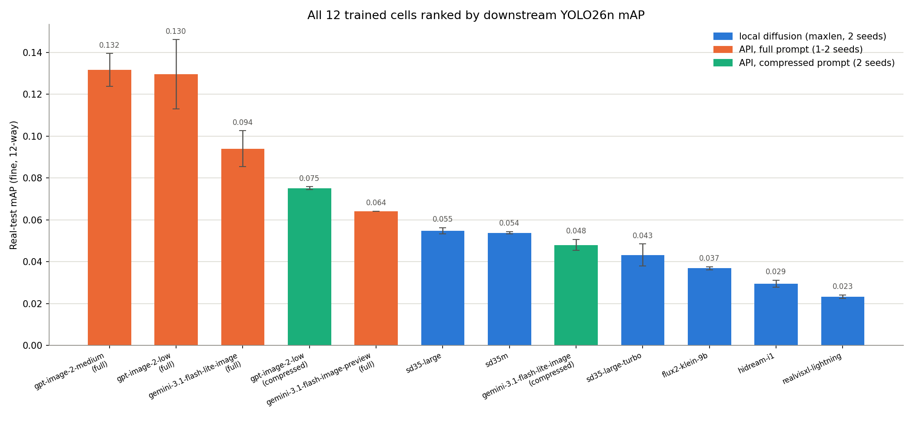
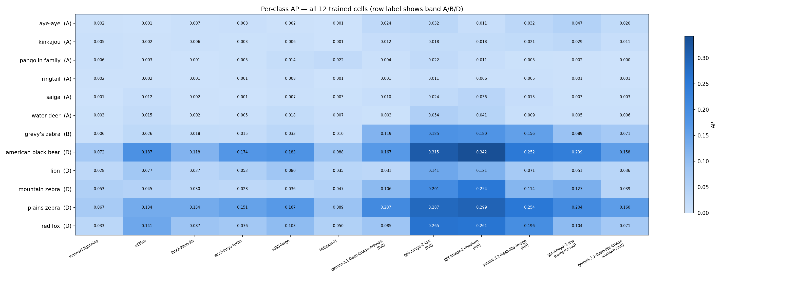
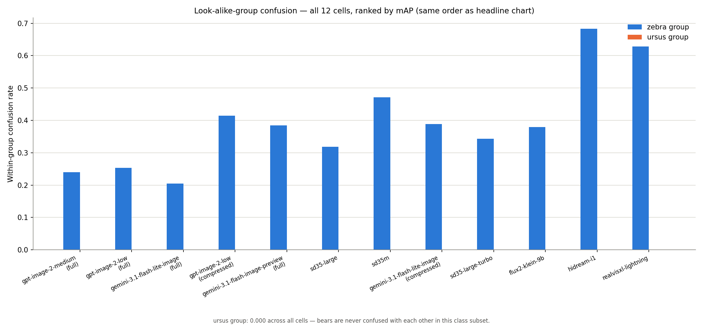

# Full comparison: all 12 trained cells + the prompt-length ablation, explained

**Created:** 2026-08-08
**Owner:** Simon Hedrich

## Scope and status

This doc consolidates everything docs [`14`](14_maxlen-cell-deep-comparison.md),
[`15`](15_all-cells-comparison-with-api-incumbent.md), and
[`16`](16_prompt-length-ablation.md) each covered separately into one place:
**every cell trained so far** (12 total — 6 local `maxlen` cells, the API
incumbent, and the 5 cells from the prompt-length ablation), one ranking,
and one explanation that ties the three earlier docs' findings together
— plus a new finding that only shows up once all 12 cells sit side by side
(see "The incumbent vs. its own cheaper tier" below).

**Same provisional caveat as every comparison in this experiment**: built
on `5-export_coco.py`'s best-effort MegaDetector export, not the
human-reviewed labels stages 3/4 would produce (TODO.md §3.2/§3.4,
deliberately deferred). Treat every ranking here as the best comparison
currently obtainable, not a final verdict.

## The headline ranking — all 12 cells



| Rank | Cell | Category | Seeds | mAP | Zebra confusion |
|---|---|---|---|---|---|
| 1 | `gpt-image-2-medium` / full | API, full | 2 | 0.132 ± 0.008 | 0.240 |
| 2 | `gpt-image-2-low` / full | API, full | 2 | 0.130 ± 0.017 | 0.254 |
| 3 | `gemini-3.1-flash-lite-image` / full | API, full | 2 | 0.094 ± 0.009 | 0.205 |
| 4 | `gpt-image-2-low` / compressed | API, compressed | 2 | 0.075 ± 0.001 | 0.414 |
| 5 | `gemini-3.1-flash-image-preview` / full (incumbent) | API, full | 1 | 0.064 | 0.384 |
| 6 | `sd35-large` / maxlen | local | 2 | 0.055 ± 0.002 | 0.318 |
| 7 | `sd35m` / maxlen | local | 2 | 0.054 ± 0.001 | 0.472 |
| 8 | `gemini-3.1-flash-lite-image` / compressed | API, compressed | 2 | 0.048 ± 0.003 | 0.389 |
| 9 | `sd35-large-turbo` / maxlen | local | 2 | 0.043 ± 0.005 | 0.343 |
| 10 | `flux2-klein-9b` / maxlen | local | 2 | 0.037 ± 0.001 | 0.380 |
| 11 | `hidream-i1` / maxlen | local | 2 | 0.029 ± 0.002 | 0.683 |
| 12 | `realvisxl-lightning` / maxlen | local | 2 | 0.023 ± 0.001 | 0.628 |

Full metric vectors and per-class tables:
`reports/model_comparison_full_downstream_map.csv` /
`_per_class_ap.csv`.

**The top 5 of 12 cells are all API models — every local diffusion model
trails behind even the weakest API cell** (`gemini-3.1-flash-image-preview`,
rank 5, still beats every local cell). That single fact reframes the whole
experiment's local-vs-API question doc `01`/`13` set out to answer, subject
to the caveats below (fewer seeds for some API cells, no `compressed`
counterpart for every local model, still-provisional labels).

## Three questions this experiment set out to answer — now all resolved together

**1. Which local diffusion model is best, and does generation cost predict
quality?** (doc 14) The SD3.5 family wins the local grid (`sd35-large` ≈
`sd35m` > `sd35-large-turbo`), and generation cost does *not* predict
quality — the most expensive local model (`hidream-i1`, ~43h/cell) and the
cheapest (`realvisxl-lightning`, ~0.3h/cell) are the two weakest performers.

**2. Is the API incumbent's edge over the local cells about the model or
the prompt?** (doc 15 asked; doc 16 answered) Doc 15 found the incumbent's
lead concentrated in the zebra classes and flagged the comparison as
confounded — model *and* prompt regime differed at once. Doc 16's
controlled ablation (same model, only prompt length varies) showed
compressing the prompt cuts mAP by **42-49%** for both `gpt-image-2-low`
and `gemini-3.1-flash-lite-image` — a large, model-independent effect. So:
**yes, it's substantially about the prompt.** The full-vs-compressed gap
(rank 2 → rank 4, rank 3 → rank 8 in the table above) is bigger than most
of the model-to-model gaps in this whole ranking.

**3. New, from this consolidated view — the incumbent vs. its own cheaper
tier.** Neither doc 15 nor 16 directly compared
`gemini-3.1-flash-image-preview` against `gemini-3.1-flash-lite-image`
*under the same prompt regime* — doc 15 compared the incumbent to a
different prompt regime (`maxlen`), and doc 16's ablation only ever varied
prompt length within one model at a time. Sitting both `full`-regime gemini
cells side by side here, for the first time, gives a genuinely single-variable
comparison: same prompt, different model. **The result: `gemini-3.1-flash-lite-image`
(rank 3, 0.094) clearly beats the production incumbent `gemini-3.1-flash-image-preview`
(rank 5, 0.064)** — not on one or two classes, but on nearly every Band D
class (`american black bear` 0.252 vs. 0.167; `red fox` 0.196 vs. 0.085;
`plains zebra` 0.254 vs. 0.207) and with lower zebra confusion too (0.205
vs. 0.384). The model actually used to build the production dataset is
outperformed by its own cheaper sibling. (Caveat: the incumbent has only 1
seed vs. Lite's 2 — see Limitations.)

The same "cheaper tier does not mean worse" pattern shows up on the OpenAI
side too, and even more starkly on cost: `gpt-image-2-low/full` ($10.11 for
1,200 images) and `gpt-image-2-medium/full` ($29.36 — **2.9x the price**)
land statistically indistinguishable (0.130 vs. 0.132, well within each
other's error bars). Paying 3x more for the higher quality tier bought
nothing measurable here.

## Per-class breakdown



Full table: `reports/model_comparison_full_per_class_ap.csv`. The same
patterns from docs 14-16 hold at this larger scale:

- **Band D (data-rich) classes carry the ranking** — `american black bear`
  alone ranges from 0.072 (`realvisxl-lightning`) to 0.342
  (`gpt-image-2-medium/full`), a 4.75x spread across the full 12-cell grid.
- **Band A (rare) classes stay in a noise floor for every cell** — every
  generator, every regime, `aye-aye`/`kinkajou`/`ringtail`/`saiga` sit
  under 0.05 AP regardless of how well that same cell does on Band D. This
  remains a resolution limit of the downstream-mAP axis, not a generator
  signal — axis A (the qualitative rubric, §3.4) is still the only way to
  compare generators on these classes, and it's still deferred.

## Confusion: the same detector-quality axis, now visible across all 12 cells



Ranked in the same mAP order as the headline chart, zebra-group confusion
tracks mAP rank closely at both ends — the top 3 cells (`gpt-image-2-medium/full`,
`gpt-image-2-low/full`, `gemini-3.1-flash-lite-image/full`) have the 3
lowest confusion rates (0.21-0.25), and the bottom 2 (`hidream-i1`,
`realvisxl-lightning`) have the 2 highest (0.63-0.68). It isn't perfectly
monotonic in the middle (e.g. `sd35m` has middling mAP but the single
highest confusion rate outside the bottom two, 0.472) — but the broad
pattern first noted in doc 14 (confusion is downstream of general detector
quality, not an independent failure mode) still holds at full scale. `ursus`
group confusion is 0.000 for all 12 cells — a structural artifact of this
12-class subset (american black bear is the only member of that look-alike
group present), not a finding.

## What this means, provisionally

If the goal is the best downstream detector, the evidence assembled across
docs 14-16 and this synthesis points the same direction on every axis
tested so far:

1. **Prompt detail matters more than which API model you pick** — the
   full-vs-compressed gap is larger than most model-to-model gaps in this
   ranking (§2 above).
2. **Cheaper tiers are not worse** — `gpt-image-2-low` ties
   `gpt-image-2-medium` at ~1/3 the cost, and `gemini-3.1-flash-lite-image`
   beats the incumbent it's supposed to be a lighter version of.
3. **`gpt-image-2` with the full prompt is the strongest synthetic-data
   source found in this experiment**, on either quality tier, and it's
   also comparatively inexpensive at the `low` tier ($10.11/1,200 images
   measured).
4. Local diffusion models, even the best of them, trail every API `full`
   cell tested — though the local grid intentionally used the
   length-capped `maxlen` regime throughout (doc 13), so this isn't a
   clean prompt-length-controlled comparison for the local side; it's
   consistent with, not proof of, finding #1 generalizing to local models.

## Limitations

- **Provisional labels** — same caveat as every comparison in this
  experiment (§3.4 deferred).
- **Uneven seed counts** — the incumbent has 1 seed, every other cell has
  2. The incumbent-vs-Lite finding (§3 above) is large and consistent
  across nearly every class, which is reassuring, but a second incumbent
  seed would firm this up.
- **Not a full factorial design** — only 2 of the 6+ local models and 2 of
  the ~4 API models have both `full` and `compressed` cells; the local
  grid has no `full`-regime cells at all (by design, per doc 13) and the
  API side has no `maxlen` cells. The prompt-length effect is demonstrated
  on 2 models, not all of them.
- **Real-only axis only** — per `docs/plans/2026-06-10_model-evaluation-strategy.md`,
  this experiment has no `mixed` test set defined, so (consistent with
  docs 14-16) everything here is the real-only axis.

## Reproducing this analysis

```
uv run python scripts/synthetic_model_comparison/9-compare_all_models.py
```

Aggregates all 12 cells' `evaluation_report.json` files (mean/std across
available seeds), writing `reports/model_comparison_full_downstream_map.csv`,
`reports/model_comparison_full_per_class_ap.csv`, and the three charts
above. No combined cost chart: local cells cost GPU-hours, API cells cost
$/image — see `6-compare_maxlen_cells.py`'s cost-vs-map chart (local only)
and doc 16 (API full-vs-compressed) for the cost angle within each axis
separately.
